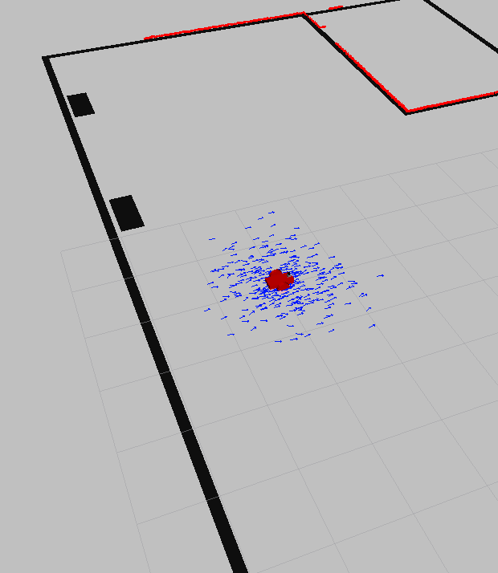
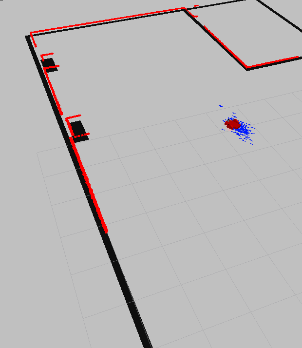
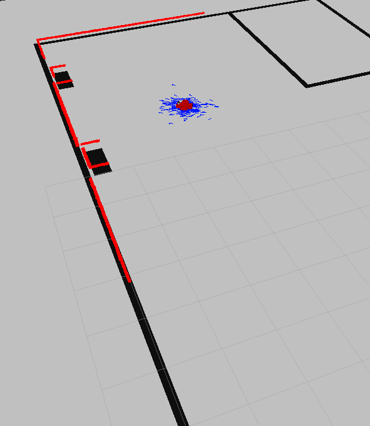
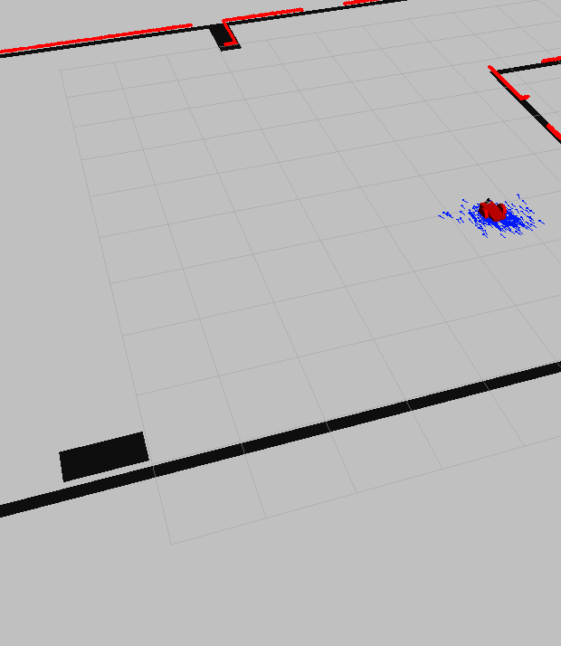

# Where Am I
This repository has a robot package based on the Go Chase It! project. It has all the dependencies to properly enable navigation maping inside a custom map, it should be cloned in a valid catkin workspace inside the src folder and must be named "my_robot".

## Project Structure

```
.
├── CMakeLists.txt
├── config
│   ├── base_local_planner_params.yaml
│   ├── costmap_common_params.yaml
│   ├── global_costmap_params.yaml
│   ├── local_costmap_params.yaml
│   └── __MACOSX
├── launch
│   ├── amcl.launch
│   ├── robot_description.launch
│   └── world.launch
├── maps
│   ├── map.pgm
│   └── map.yaml
├── meshes
│   └── hokuyo.dae
├── my_robot.rviz
├── package.xml
├── README.md
├── urdf
│   ├── my_robot.gazebo
│   └── my_robot.xacro
└── worlds
    ├── empty.world
    └── HomeFirstFloor.world
```

## How to Compile and Run

Create a workspace and clone the project inside the src/my_robot folder.

```
$ sudo apt-get install ros-kinetic-navigation ros-kinetic-map-server ros-kinetic-move-base ros-kinetic-amcl -y
$ cd /home/user
$ mkdir catkin_ws
$ cd catkin_ws/
$ catkin_init_workspace
$ catkin_make
$ cd src
$ git clone https://github.com/GooseCoder/RobotivsEngND-WhereAmI my_robot
```

Second open the workspace folder, compile and run the robot project.
```
$ cd ..
$ catkin_make
$ source devel/setup.bash
```

Finally run all the required components using the roslaunch command in three different terminals.

```
$ roslaunch my_robot world.launch

$ roslaunch my_robot amcl.launch

$ rosrun teleop_twist_keyboard teleop_twist_keyboard.py
```

## Screenshoots of the robot navigation in action





